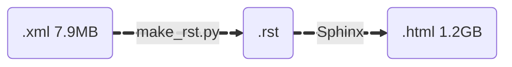
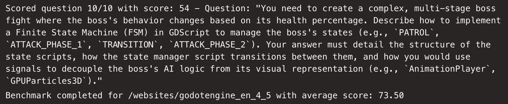

+++
title = "What's in a doc?"
date = 2025-10-06
draft = false
summary = "Would you rather have tons of documentation that distracts your agent, or just the right amount that helps it become your best coding buddy?"
+++

# Factual grounding

Docs are cool. Docs are useful. Software is a dynamic entity, and your knowledge can become obsolete pretty quickly.

When that happens, humans can look at documentation to re-align themselves with the ground truth of the code.
AI agents, on the other hand, aren’t exactly known for introspection — or for seeking factual grounding when they’re unsure about their answers.

One way to help them stay grounded is to inject documentation into their context, leveraging [in-context learning](https://transformer-circuits.pub/2022/in-context-learning-and-induction-heads/index.html#in-context-learning-key-concept) — basically, giving them a stack of flashcards to consult during the exam.

But that’s a double-edged sword: useful information can enrich their capabilities, while the wrong information can [poison their thoughts](https://research.trychroma.com/context-rot).

A quick look at the Godot docs reveals a troubling fact: the docs folder for version 4.5 is **1.25 GB**. Of `.html` files!?!? How?
A peek into any of those HTML files shows the root problem: each one contains over **12,000 lines** of table of contents... woah.

Can we get rid of it? Sure — but what about not *having it* in the first place?

[Godot](https://github.com/godotengine/godot) contains `.xml` descriptions for [each class](https://github.com/godotengine/godot/tree/master/doc/classes), which are turned into `.rst` files using a [Python script](https://github.com/godotengine/godot/blob/master/doc/tools/make_rst.py), and finally into HTML files using the [Sphinx](https://www.sphinx-doc.org/en/master/) documentation builder.

That’s a massive blow-up in size. What if we hijack the `make_rst.py` script to output a more LLM-friendly format?
We could also discard information that’s very useful for humans (like summary tables) but wasteful for machines with much more limited working memory.

# What do others do?

Before diving in, I was curious to see how other projects handle their docs.

* [context7](https://context7.com/?q=godot): Some projects do a pretty good job scraping and parsing docs.
   ([full output](./vector2.txt))
  Interestingly, they also [benchmark](https://context7.com/logs/websites/godotengine_en_4_5) their results:
  
  though I’m not entirely sure what that means exactly.

* [LLM-Docs](https://llm-docs.com/): Others take a more “cookie-cutter” approach
  
  and end up leaving unwanted information in the data:
  

# Tailoring it to Godot

I think our agents deserve better. Honestly, I want better for myself too.
I haven’t had the smoothest experience browsing Godot’s documentation — so why not get two birds with one doc “Doc” sounds like “rock,” and a rock is a stone, so…

I’ve built a simple search script to navigate the processed docs we’ll serve to agents.

And voilà — nice, searchable docs, without any [scraping](https://docs.crawl4ai.com/) needed.

 If you'd like to try it yourself checkout [this repo](https://github.com/lfrati/godocs) 

