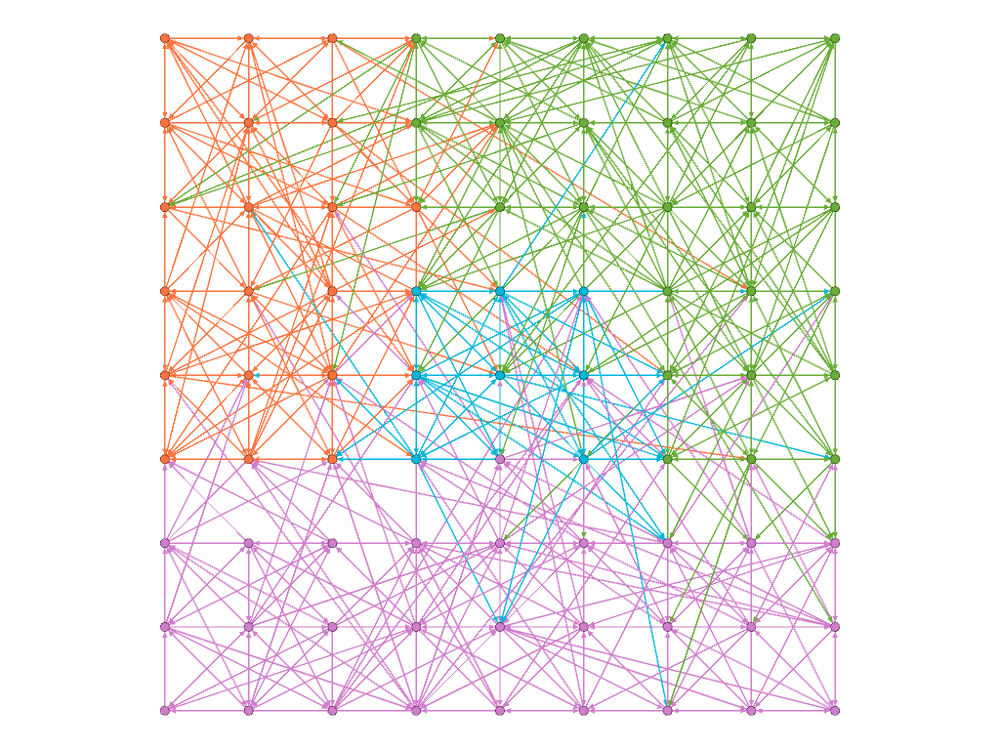
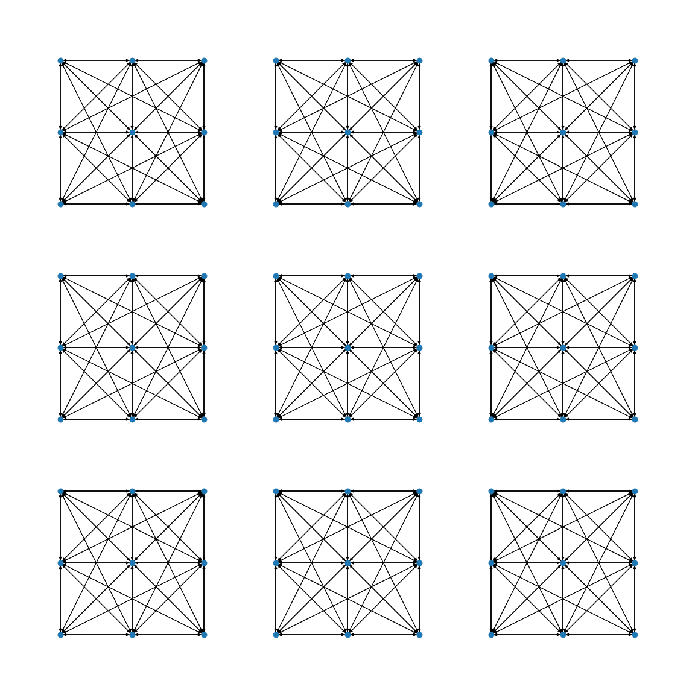
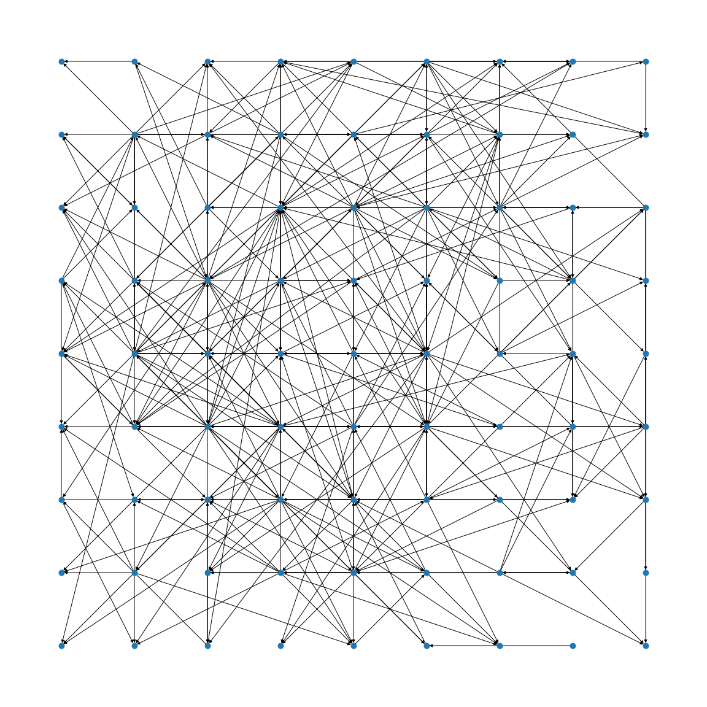

+++
title = 'A Peek into Neuromodularity'
date = 2023-11-12
draft = false
summary = "Exploring the intersection of geometric graphs, complex contagion, and neural networks through interactive visualizations and reservoir computing."
thumbnail = "neuromod_thumb.png"
+++

 Warning: All sketches in this page are running on your machine. May the gods of computing bestow their blessing upon you. 

# Geometric graphs

When working with networks it is common to assume that edge properties and node properties are somewhat independent. Nodes often contain information about the entity they represent and edges describe the relationships between those entities. However in practice it is often the case that nodes may be embedded in some space of interest. Let us consider the case where nodes represent cities and edges are the roads between them. It is intuitive to assume that each node (i.e. city) is associated with some coordinates. Given the coordinates of a node it is natural to assume that each link (i.e. road) has a certain length that might not be explicitly listed among the properties of those edges.

These extra pieces of information are introduced by the space in which the nodes are embedded thanks to some **distance metric** (e.g. Euclidean distance) defined on it.
When this extra information is available we can employ it to enrich the mechanisms that shape our networks. For example, we can make the rule that nodes are only able to make connections within a certain "range" defined by that distance like in the sketch below.



Moving the slider from **local** to **global** increases the range at which nodes can form connections. Click to sample new networks.

This embedding into a 2D space can open up many new possibilities. As we have seen before the generation of random networks can now rely on the new concept of "distance".
It is now possible to define a **local** connectivity (i.e. connecting preferentially to nodes at a short distance) vs **global** (i.e. connecting equally to nodes at every distance).

This approach is called [Geometric Random Graph](https://en.wikipedia.org/wiki/Random_geometric_graph). In this type of network the connectivity is controlled by a radius parameter, such that each node wires with all the nodes within that radius. Below you can see how the number of links and connected components vary as the radius parameter changes. The network starts off with no edges but as the connection radius increases the number of connected components quickly converges to a single giant component. We are employing a hard threshold (i.e. connections are made with every node within the range, and no nodes outside the range) for simplicity for now but other alternatives exist, where connections are made probabilistically and closer nodes have higher probabilities (i.e. Gaussian probability decay as distance increases), which we are going to use later on.



**Links** counts the number of edges formed with the current radius size while **components** shows how many connected components there are. Click to sample new networks.

If we consider **modularity** as the situation where connections between nodes belonging to the same module are more than those between different modules then we can see that the distance-based approach can lead to a similar concept but with a sense of distance-based clustering.
In our examples nodes are sampled uniformly over the available space but if the nodes were to be clustered into groups their local connections would naturally end up leading to a concept similar to modularity. 
Now modules are groups of nodes that are close together in space, and in virtue of their closeness the number of connections *within* the module is going to be higher than the number of connections *between* modules recovering the previous concept of modularity.

# Complex contagion

It is easy to draw a parallel between the geometric graphs we have been talking about and systems composed of many spatially embedded nodes such as the **neurons** in a brain. In the same way infectious individuals spread from a city to city, activity spikes are transmitted from neuron to neuron. However, neural networks provide even richer dynamics than those already complex one of infection spreading. Neurons can interact with each other in complex non-linear ways, a behaviour called **complex contagion**. In social networks this behaviour is particularly common. As we can imagine, when interacting with other people an idea that reaches us from many different directions is much more effective. We can try to approximate this scenario in the following way:

- Neurons fire when the incoming impulses surpass a certain **threshold**.
- Incoming impulses add up, but constantly **decay** (i.e. multiple simultaneous inputs are much more effective than multiple single ones).
- Each time a neuron fires the threshold for firing is raised.



Forcing a neuron to **fire** repeatedly with impulses coming from a single source is much harder than having multiple inputs coming from multiple neurons at the same time.

# Complex spreading dynamics

When these mechanisms (geometric embedding and complex contagion) are combined the results quickly increase in complexity. In the following sketch we can see them at work. A network that describes a collection of neurons has been generated using the rules we have introduced. Using the mouse wheel or clicking we can now excite one of the neurons to make it send actvity spikes to its neighbours. When a lot of impulses are travelling along an edge the thickness increases and the color changes to red. Neurons' color also turn to red the closer they get to firing. As neurons start firing their size increases along with the thin grey circle around them that represents the spiking threshold.

Feel free to experiment exciting different neurons and see how the activity spreads through the network. To keep the overall activity under control the amount of impulses that can be present at any given time is capped. Also, since the threshold for spiking increases as the neurons keep spiking we can see that increasing the connectivity of the network the neurons will blow up incredibly before starting to deflate.



**I**: determines the threshold level, raising it will result in the activity to spread much less.  
**r**: represents the connection radius, raising it the number of edges will increase.  
Press reset to sample a new network. Use the mouse wheel or click to release tons of impulses.

# Reservoir Computing

The topics we have introduced and discussed so far are particularly relevant for a specific branch of Machine Learning known as Reservoir Computing. Traditional Neural Networks (artificial or biological) employ deep stacks of neurons that process input signals in a feed-forward fashion.
These deep neural networks have achieved outstanding results in recent years. However optimizing the deep stack of layers that form modern neural network architectures can be challenging and they require specialized structures to process complex temporal signals. These problems can be lessened by employing a **Neural Reservoir**, a randomly initialized sub-network with recurrent connections (i.e. connections feeding back into the reservoir).
This neural reservoir is then connected to two smaller layers, one that sits between the inputs and the reservoir, and one that receives signals from the reservoir and passes them to the output.

You can see a schematic version of this architecture in the following sketch. On the left the white/black squares represent input units. The signals from those units are fed into the neural reservoir represented by the random geometric graph in the middle. The signals propagate through the neural reservoir before being read by the green output units on the right. The signals received by output units are graphed under the network in an ECG style.



**Left**: Set the input pattern by toggling on/off the white/black squares.  
**Center**: Press **"Fire"** to send the signal inside the neural reservoir and watch it propagate through it  
**Right**: When signals reach the green units the corresponding node activity spike is plotted on the bottom ECG  
Press "reset" to sample a new topology, use the sliders to control the connection radius and the activation thresholds.

All that would be left to complete the hypothetical training scenario would be to add mechanisms to train the input/output connections. Obviously the sketch above is just meant to give a general understanding of the setup. In practice there are various considerations to be made and different choices lead to different implementations.

The main difference of our little sketch with actual models is probably the fact that signals spread at a constant speed (where speed is introduced because we have an Euclidean distance between nodes, and hence we can talk about something like meters per second). Often the connections between nodes are represented as "just" adjacency matrices or, if chasing a better biological plausibility, as a 3D **lattice**.
We are going to employ a similar approach to keep a notion of space while avoiding the full additional complexity of unrestricted space. Our nodes are going to be arranged in a 2D lattice so that nodes have a notion of spatial neighbours.

# The dangers of time

As we approach the end of our introduction we are going to spend a few words about our handling of time in our simulations. Despite the appeal of using continuous time there are some caveats to be considered. If we seed the network by forcing one node to spike and start sending signals to its neighbours we have to consider that some of those signals might arrive before others. While apparently innocuous this detail can quickly set our machines on fire. That is because the number of events we need to keep track increases **exponentially**, as every node spiking will likely generate more than one signals.

This problem can be counteracted either by using some careful wiring and appropriate activation thresholds or by removing the notion of time entirely. If we chose the latter every signal travelling on an edge leaves and arrives at the same time as everyone else's which means the number of concurrent events to track per time step is now bounded by the number of edges in the network. In the following sketch we can get a feeling for the dangers of time on lattice networks with a few random connections (the difference between constant speed and constant crossing time is more visible on longer edges).

On the left we have a version of our network where edges are crossed at a constant speed based on the distance between the endpoints. On the right instead we have the same network but the time to cross an edge is constant no matter it's length. You can select a node on the left and it's counterpart on the right (both highlighted in yellow) and click to start releasing signals. The more signals are sent the faster the symmetry between the two versions will be broken. If enough signals are sent the time-based version will probably start blowing up (signals are capped at 1000 for your own safety), while the time-less counterpart will probably settle on a steady activation level.



**Left**: signals propagate at fixed speed so crossing longer edges take more time.  
**Right**: every edge takes the same time to be travelled so all the signals arrive simultaneously at their destination.  
Move your pointer to any node on the left to select it (i.e. turn yellow) along with the corresponding node on the right.  
Click to send signals in both networks and see how quickly their activation patterns diverge because of absence/presence of time.

# Spiky lattices

We have discussed the role of space and time in growing our geometric networks so we can now state a bit more clearly what our intent is. Recent works on neural reservoirs have highlighted the relevance of modularity in forming useful reservoirs that can provide long lasting signals to learn from. It is especially apparent in the case where the reservoir uses hard thresholds as their source of non-linearity, and the resulting dynamic is very close to that of **complex contagion**, the relevance of having highly connected modules.
In that scenario producing and sustaining spikes requires multiple simultaneous signals that have to come at just the right time. A tightly connected component can provide the push needed to cross those thresholds. Why not have a fully connected graph then? If all the nodes spike all the time then the information present in those spikes is almost none and hence the reservoir is unsuitable for learning. We are not going to perform learning in our experiments. We are going instead to focus our attention on the role of modularity and mechanisms that lead to its formation.

In the following sketch we show a simple scenario using a lattice network with local connections and low activation threshold of 3. Nodes are connected randomly with a local preference that scales linearly with distance. As you change the level of connectivity of the network you can observe that activity can either _saturate_ (i.e. almost all nodes fire all the time) or _vanish_ (i.e. the signals are not sufficient to cross the thresholds).



Use the slider to change the level of connectivity in the system. Use the mouse to send signals from certain nodes or use the button "spark" to send one signal from every node at the same time. The activity bar shows the number of nodes that are currently spiking (i.e. green for none, red for all).

# Optimal modularity

We are now reaching the end of this whirlwind tour of neural reservoirs and geometric networks. The last piece we want to present is a recent result in "_Optimal modularity and memory capacity of neural reservoirs_" (Rodriguez et al.). In their work the authors show that in neural reservoirs an optimal balance between community formation and global connections can be found, so that the resulting reservoir maximizes the learning capability of the systems it is used in. The experiments we are going to focus our attention on involve a **parameter μ** that balances the ratio of local (i.e. within a community) vs global (i.e. between communities) connections.

- When μ = 0 the connections are entirely local, which means that every node is connecting only to other nodes in the same community (defined a priori) → Maximal modularity.

- When μ = 0.5 half of the connection of each node are made with nodes in the same community and half with nodes from the other communities → Minimal modularity.

As μ varies between 0 and 0.5 we can observe different behaviors of the system when we excite some neurons in response to a hypothetical outside stimulus. For values near 0 the communities are very strongly wired and are able to easily overcome the activation threshold needed for sustained spiking but the signal remains confined inside the community because of the lack of bridges to other communities. At the other end of the spectrum when μ approaches 0.5 the input signals are able to reach most neurons in the network but the signal quickly dies out because the connection are too _spread out_ and unable to consistently reach the activation threshold.
Between these two extremes it is possible to find a **balance** point where the local structure is sufficiently tight to sustain spiking over long periods of time, and the amount of global connections is sufficient to spread the signals to other communities.

Below you can see a sketch that shows a simplified version of the setup we just mentioned.
There are 9 communities of 16 nodes each that start initially fully wired within their local communities. As you increase the value of μ local connections are selected at random and turned into global connections by rewiring them to connect to a random node from another community. This process is repeated until the ratio of local/global connections equals μ. This process involves only rewiring so the overall number of connections remains the same, only the wiring structure is changed. The problem has been simplified by assuming that every connection is of equal unitary weight and that interactions are only excitatory. This obviously reduces the possible dynamics of the system but is still sufficient to see how different levels of modularity influence the outcomes.



Click on nodes to send signals to their neighbours. Use the "reset" button to sample new networks.  
Use the "seed" button to send signals to an entire community at once. Use the slider to adjust the value of μ.

# Evolved communities

A natural question to ask is "Can a similar optimal modularity be grown?". To test this possibility we have employed an evolutionary algorithm that has been optimizing a fitness function that explicitly rewards spreading between communities. During each epoch of our evolutionary training each of the communities in our network has been artificially spiked. This can be seen as receiving an input from outside, like would happen when a contiguous brain region receives sensory inputs. 

The results have then been analysed using some standard modularity detection algorithms such as **Louvain**. As can be seen below such optimal modularity is almost entirely recovered and the networks evolve toward a μ measure of roughly 0.4, which is consistent with the results obtained in other studies. Some of the communities identified using the Louvain measure have been joined together but we can still identify the original block structure. In all experiments the center community can be clearly distinguished from the others due to the specific setting used. As the only "central" community in close proximity to all other it can play a key role in facilitating the spread of information between distant communities.

  
  

    Topology evolved using the described fitness functions. Various communities have been joined together but only 2 nodes out of 81 have been assigned to the wrong super-community.
  

# Information Diffusion

How does the system coordinate itself as a whole while relying only on local interactions? And how much information must those signals carry? Our first attempt at modelling local interactions involves relying on the spiking levels of nodes. More specifically each node that spikes releases a "virtual" medium that carries information about the activity levels to other nodes in its **Moore** neighbourhood. Neighboring nodes that receive this info from multiple sources gather it to form an approximate, temporally delayed representation of the overall activity of the whole system. 

Below we can see an example of this information spreading in a chemical looking fashion. The short clip shows, for each node in the network, the absolute difference between their local information and the actual activity level of the system. Darker colors represent nodes that have a good approximation of the global spiking levels. Brighter colors instead represent nodes that are lagging behind. We can see information fronts slowly diffuse through the network as the local information is passed from node to node.

  <video muted autoplay loop style="max-width: 100%;">
      <source src="gossip_diffusion.mp4" type="video/mp4">
  </video>
  
Information diffusion across the network. Each cell is colored based on the absolute difference between the local information and the true activity of the network.

Now that approximate spiking information is available to nodes we can define some rules to guide edge formation. The nodes in the network are placed on a 2D lattice as in the previous examples, and the initial edges are sampled from bivariate gaussian distributions that favor local connections. 

Edge formation is biased using a local gaussian distribution,  as shown in the visualization on the right. This approach creates initial networks that have a tunable degree of locality but are not optimized for spreading. The plot shows 10k sampled edges for a node in position (10,20), where darker shades of blue represent edges that are sampled more frequently. On the sides the marginal gaussian distributions are shown using kernel smoothing.

The algorithm we have tested to promote locality works as follows:
- If the node being optimized is **spiking**: the spiking information is used to locate nodes that are not spiking. This is done by multiplying it by the gaussian distribution used for edge formation so that close by nodes with low activity are more likely to be sampled.
- If the node being optimized is **not spiking**: the spiking information is used to locate nodes that have been consistently spiking and an edge from that node to the current node is formed by rewiring one of the other outgoing connections from the current node.

This approach is aimed at simulating a simple setting where neurons that spike release "chemical" that favor the formation of new outgoing connections while neurons that don't reach the spiking threshold undergo a reverse process that stimulates forming new connections with them.

Unfortunately this approach doesn't seem to lead to the emergence of modularity that we are looking for. Quite the contrary it seems that even when networks start from perfect modularity (μ = 0) the community structure is degraded rather than improved. To understand why this might be happening we can look at the first few iterations of our "optimisation" process. The network in questions is formed by 9 communities arranged in a 3x3 grid. During each episode every pre-determined module is artificially sparked in turn. Activity is left spreading for a number of iterations sufficient to allow for every community in the network to start spiking (or until the activity levels drop to zero).
As we can see below as simulation progresses we can observe that the signals start reaching farther and farther nodes (activity pane on the left shows more spread out activity patterns). The nodes able to spike become fewer and fewer (spiking pane on the right shows spikes rapidly stopping, until each episode resembles a blip).

  <video style="width: 47.5%;" muted autoplay loop>
      <source src="failed_activity_cropped.mp4" type="video/mp4">
  </video>
  <video style="width: 47.5%;" muted autoplay loop>
      <source src="failed_spikes_cropped.mp4" type="video/mp4">
  </video>

<b>On the left</b>: Activity levels of the neurons that receive signals, as the modularity decreases the signals spread over a larger area.   <b>On the right</b>: neurons that manage to cross the spiking threshold. As the modularity decreases fewer and fewer neurons are able to spike (as activity decays to zero faster and faster the episodes become shorted which makes the recording look as if accelerating).

If we take a closer look at the network topology we can observe the effect of our local rules. Below you can see, on the left the initial perfectly modular structure, and on the right the results of several rounds of "optimisation". We can notice that several nodes have a large number of incoming/outgoing connections. This happens because nodes that are selected as the best candidates for a specific node are likely to be the best candidates also for all its neighbors. The diffusion mechanism has allowed nodes to access global information through local mechanisms but they lack the **cooperation** mechanisms needed to avoid **over-exploiting** that information.

  

    
    
Initial modularity.

  

  

    
    
Disrupted modularity.

  

# Minimal modularity

How much connectivity is essential to ensure the signal from a community can spread to all the others? What kind of wiring is crucial to keep a community alive? If we consider the constraints imposed by the threshold function we use in our experiments we can calculate minimal conditions for survival. In particular we can identify two necessary components in our communities:
- a "surviving" fully connected sub-component capable of overcoming the threshold set
- an "activating" set of edges that keep the rest of the community alive
- a "spreading" set of connections that are able to propagate the signal to neighboring communities.

Once an activation threshold is determined then a minimal surviving **clique** is a set of _threshold + 1_ fully-connected nodes.  The diagram on the right illustrates this concept, showing in **red** a fully connected sub-component of 3+1 nodes that can survive a threshold of 3. In **blue** are the additional edges needed to make the rest of the community spike. The remaining connections can then be used to make the adjacent communities spike.

To minimally connect two communities we need to make every node in the kernel of the community we want to excite spike. Since the kernel contains _threshold+1_ nodes and each of them needs to receive at least _threshold_ signals for a total of _threshold x (threshold + 1)_ edges. We can see this set up in the sketch below. Each community is connected to the next one forming a chain of communities that spans the whole network. The whole structure is resting on a precarious **equilibrium** since the network has barely enough signal to overcome the threshold barrier. We can see an example of this by using the "sabotage" button below. If enabled one single edge is removed from every center node of each community (the crippled node is shown in black). In this new regime the damaged kernel doesn't have enough activity to keep spiking so after propagating the signal the activity in the community dies out. This creates an interesting effect where the signal travels along the chain of communities like a propagating wave.



Use the "seed" button to manually spark the first community.  
Use the "sabotage" checkbox to remove one edge from each community.  
Nodes missing an edge are shown in black, kernel nodes in red and spreading nodes in blue.

This seemingly secondary result is more interesting than expected. What we have obtained seeking the minimal possible wiring is a setup where each community is essentially a node of a network in "**community space**". The nodes in this new space are supersets of the previous nodes where the "complex contagion" property has been assimilated into the activation function. Consider for example the case where activity is both excitatory and inhibitory, the previously simple threshold function that controls the activity in "nodes space" now becomes a much more complex stateful function in "community space". This complexification mechanism can allow us to appreciate the emergence of complex behaviour in networks governed by simple activation functions. Especially so if we consider that the network itself can change over time as a function of its own activity.
